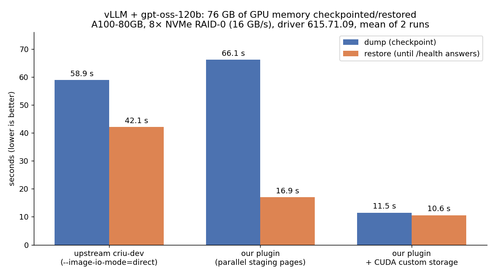

# bench-criu

Checkpoint/restore benchmarks for GPU (CUDA / PyTorch / vLLM) workloads with CRIU and the NVIDIA
`cuda-checkpoint` driver API, comparing upstream CRIU with the changes we intend to propose upstream
([oOraph/criu `upstream-cuda-custom-storage`](https://github.com/oOraph/criu/tree/upstream-cuda-custom-storage)).

## Headline result (2026-10-05)

vLLM serving **gpt-oss-120b** on an **A100-80GB** (AWS `p4de.24xlarge`, 8× NVMe RAID-0 at 16 GB/s,
driver 615.71.09). vLLM fills the card with KV cache, so the checkpoint is **76 GB of GPU memory**
regardless of the model (Qwen3-8B gives the same numbers). Cold start of the server is 3 minutes.



| variant | dump | restore | what it does |
|---|---|---|---|
| upstream `criu-dev` `4485a86da`, `--image-io-mode=direct` | 59 s | 42 s | driver copies VRAM to host RAM, CRIU writes those pages like any other memory |
| our branch, custom storage off | 66 s | 17 s | driver still copies VRAM↔host RAM; the plugin moves the staging pages itself with O_DIRECT and 16 `process_vm_writev` threads (21 GB/s on restore), bypassing the page cache |
| our branch, **custom storage on** (driver ≥ 615) | **11.5 s** | **10.6 s** | the plugin reads/writes VRAM directly through driver-exposed device mappings, pinned buffers and CUDA streams; no host staging copy at all |

Restore is now 7 s of VRAM copy (10.8 GB/s into the mapping) plus 3 s of CRIU work on the 3.7 GB of CPU
pages and the process tree. Details, per-run numbers and raw logs:
[results/2026-10_p4de_custom_storage_615/](results/2026-10_p4de_custom_storage_615/summary.md).

## What is compared

| Image target | Source | Description |
|---|---|---|
| `criu-upstream-head` | [checkpoint-restore/criu](https://github.com/checkpoint-restore/criu) `criu-dev` @ `4485a86da` (2026-09-24) | upstream: libcuda Driver API backend, PR #3021/#3022 (parallel memfd restore, AIO/O_DIRECT image reads), `--image-io-mode=direct` (PR #3066, off by default), LZ4 |
| `criu-ref` with `CRIU_REF=upstream-cuda-custom-storage` | [oOraph/criu](https://github.com/oOraph/criu/tree/upstream-cuda-custom-storage) | upstream head + the series proposed upstream: staging-page offload (O_DIRECT, parallel `process_vm_writev` restore) and CUDA custom storage (`--plugin-option=cuda_plugin.custom-storage=auto\|on\|off`, `auto` enables it on driver ≥ 615) |

`Dockerfile.vllm` builds either CRIU into a vLLM image (`APP_IMAGE`, `CRIU_REPO`, `CRIU_REF`). Older
targets in the `Dockerfile` (`criu-dev`, `criu-optimized`, `criu-fast-cuda-1`, `criu-v42-ours`) are the
builds behind the earlier result sets and are described in those summaries.

### Why the plugin is faster

With `cuda-checkpoint` the driver copies all of VRAM into the target process's host memory, and CRIU
then dumps that memory as ordinary pages. Upstream pays the driver copy (A100: ~38 s for 76 GB at
~2 GB/s on dump, ~10 s on restore) plus a page-cache-bound write/read of the same volume. Our plugin
detects the staging VMAs, writes them with O_DIRECT and drops them from the target (dump), and on
restore fills them in parallel straight from disk before the driver copies them back. With the
CUDA 13.4 custom-storage API (driver ≥ 615) the driver copy disappears entirely: the plugin streams VRAM
to and from disk itself, and the time is the disk or PCIe time, whichever is slower.

## Benchmarks

| Script | What it measures |
|---|---|
| `bench_compare.sh` | synthetic: a torch app holding `TENSOR_SIZE`² floats (60 000 ≈ 14.9 GB), dump and restore with integrity check; scenarios `label\|image\|criu options` |
| `bench_vllm.sh` | real inference: `vllm serve` checkpointed while serving, restore timed until `/health` answers, then a completion validates the engine; `SLEEP_MODE=1` adds vLLM sleep level 1 before the dump |
| `bench_sdxl.sh` | huggingface-inference-toolkit + SDXL |
| `fio.sh` | storage ceiling of the box (sync qd1, libaio qd32, raw single drive) |
| `run_p4de_cs.sh` | the one-shot session behind the headline result (driver, images, weights, tensor + vLLM matrices) |
| `proto/` | standalone custom-storage prototype (`cuda_cs.c`), driver `.run` installer with Fabric Manager handling, probes |

CRIU runs as root on the host and enters the app container's namespaces with `nsenter`, as runc does.
Dump directories live on the NVMe array; caches are dropped between dump and restore (`DROP_CACHE=yes`).

### vLLM dumpability recipe

The server must be started with `UV_USE_IO_URING=0` (uvloop would use io_uring, undumpable),
`HF_HUB_OFFLINE=1 VLLM_NO_USAGE_STATS=1 DO_NOT_TRACK=1` (no open HTTPS sessions to the Hub),
`GLOO_SOCKET_IFNAME=lo` and `TORCH_NCCL_ENABLE_MONITORING=0 TORCH_NCCL_DUMP_ON_TIMEOUT=0`.
CRIU options: `--shell-job --skip-in-flight --file-locks --ghost-limit 10485760 --tcp-established --link-remap`.
Sleep mode needs `VLLM_SERVER_DEV_MODE=1`. `bench_vllm.sh` sets all of this.

## Setup

Disposable VM with NVMe instance store, an NVIDIA GPU, Ubuntu 24.04/26.04.

```bash
./setup.sh                      # NVIDIA driver (NVIDIA_DRIVER=610 from the Ubuntu archive), Docker, nvidia-container-toolkit,
                                # RAID-0 of the free NVMe drives at /mnt/nvme (single drive used as is)
SKIP_DRIVER=1 ./setup.sh        # keep a preinstalled driver
sudo proto/install-driver-run.sh 615.71.09   # proprietary driver from NVIDIA's .run (needed for custom storage, driver >= 615);
                                             # on NVSwitch boards (p4d/p4de/p5) also installs the matching nvidia-fabricmanager
                                             # from NVIDIA's CUDA apt repo (the Ubuntu archive stops at 595)
```

Fast storage matters: on a single NVMe (g5: ~2.5 GB/s read) every variant is disk-bound and the gains
shrink; the 16 GB/s array of the p4de is what exposes the plugin ceilings.

## Build and run

```bash
docker build --target criu-upstream-head -t criu-upstream-head .
docker build --target criu-ref -t criu-head-cs --build-arg CRIU_REF=upstream-cuda-custom-storage .

# synthetic
SCENARIOS="cs-on|criu-head-cs|--plugin-option=cuda_plugin.custom-storage=on;upstream-direct|criu-upstream-head|--image-io-mode=direct" \
  TENSOR_SIZE=60000 RUNS=2 sudo -E ./bench_compare.sh

# vLLM
docker build -f Dockerfile.vllm -t vllm-criu-upstream --build-arg CRIU_REPO=https://github.com/checkpoint-restore/criu.git --build-arg CRIU_REF=4485a86da237 .
docker build -f Dockerfile.vllm -t vllm-criu-cs --build-arg CRIU_REF=upstream-cuda-custom-storage .
hf download openai/gpt-oss-120b --cache-dir /mnt/nvme/hf   # weights go to $HF_CACHE
MODEL=openai/gpt-oss-120b RUNS=2 \
  SCENARIOS="cs-on|vllm-criu-cs|--plugin-option=cuda_plugin.custom-storage=on;upstream-direct|vllm-criu-upstream|--image-io-mode=direct" \
  sudo -E ./bench_vllm.sh
```

Results are printed as `RESULT label=... run=... dump_ms=... restore_ms=...` lines.

## All results

| Date | Box | What | Link |
|---|---|---|---|
| 2026-10-05 | p4de.24xlarge, A100-80GB, 8× NVMe 16 GB/s, driver 615 + FM | **custom storage vs parallel plugin vs upstream**, tensor + gpt-oss-120b + Qwen3-8B | [summary](results/2026-10_p4de_custom_storage_615/summary.md) |
| 2026-10-02 | p4de.24xlarge, A100-80GB, driver 595 | plugin ceilings with the disk out of the way: serial vs parallel restore, upstream; SDXL, Qwen3-8B (plain and sleep level 1) and gpt-oss-120b through vLLM; the "driver copy" measurements that motivated custom storage | [summary](results/2026-10_p4de.24xlarge_a100/summary.md) |
| 2026-10-02 | g5.12xlarge, A10G, driver 615 | first custom-storage prototype measurements (standalone tool, single NVMe, tmpfs ceiling) | [summary](results/2026-10_g5_custom_storage_615/summary.md) |
| 2026-10-02 | g6.48xlarge, 8× L4, 8× NVMe capped at 5 GB/s | is the plugin or the disk the bottleneck (tensor test, mlock control) | [summary](results/2026-10_g6.48xlarge_l4/summary.md) |
| 2026-10-01 | g5.12xlarge, A10G, single NVMe | our v4.2 plugin vs upstream head | [summary](results/2026-10_g5.12xlarge_a10g/summary.md) |
| 2026-06 | g6.12xlarge, L4 | synthetic mini benchmark, June builds | [summary](results/mini_benchmark/summary.md) |
| 2026-06 | g6.12xlarge, L4, Kubernetes | real inference (SDXL, Llama-3.1-8B, Qwen3-8B) via runc checkpoint/restore | [summary](results/real_inference/summary.md) |
| 2026-06 | g6.12xlarge, L4 | vLLM cooperative sleep/wake-up (Llama-3.1-8B, Qwen3-8B) | [summary](results/vllm_sleep_awake/summary.md) |
